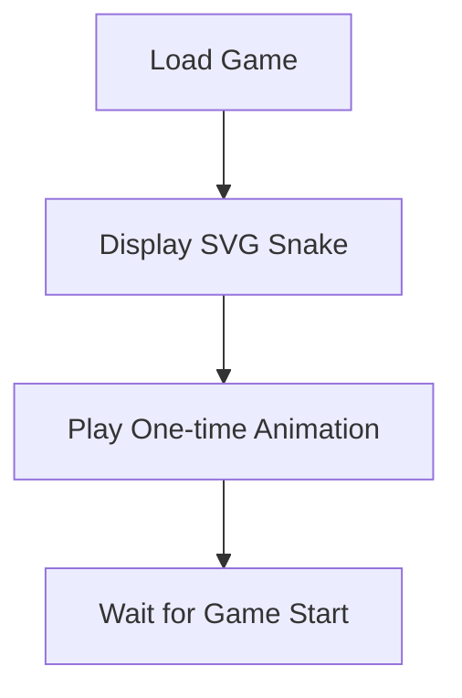
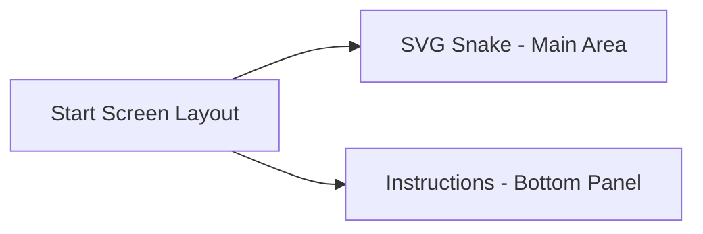

# Plan: Child-Friendly Snake Game Start Screen

## Current Issues
- Food and snake tiles are visible before game start
- Text instructions appear in the center of the screen
- Start screen has a semi-transparent black background

## Implementation Plan

### 1. Create Cute Snake Background
I'll implement an SVG illustration of a friendly cartoon snake that:
- Has bright colors appealing to children
- Features a friendly face with big eyes and a smile
- Includes a simple "wiggle" animation that plays once when the game loads



### 2. Hide Game Elements Until Start
I'll modify the rendering logic to:
- Hide both food and snake elements until the game starts
- Only render these elements after the player presses a button/key

```jsx
// Current code:
<div className="food-element" />
{snake.map(segment => <div className="snake-segment" />)}

// Modified code:
{gameStarted && <div className="food-element" />}
{gameStarted && snake.map(segment => <div className="snake-segment" />)}
```

### 3. Reposition Instructions to Bottom
I'll restructure the start screen overlay to:
- Position instructions at the bottom of the screen
- Add a semi-transparent background only behind the text for readability
- Keep the SVG snake as the main visual element



### Code Implementation Details

#### SVG Snake Component
- Create a colorful, friendly snake using SVG paths
- Use react-spring for a simple animation
- Position centrally in the game area

#### Start Screen Layout
- Keep transparent background for the main area
- Add semi-transparent panel only at the bottom for text
- Maintain all current instruction text

#### Conditional Rendering
- Wrap food and snake segments in conditional rendering based on gameStarted
- Maintain all other game functionality

This implementation requires no external images and will integrate with the existing codebase.